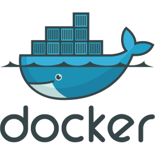

Ansible role: Docker
=========

This role helps you to install docker and docker-compose on your linux machine.


|Travis|CircleCI|GitHub|Quality|Downloads|Version|
|------|--------|------|-------|---------|-------|
|[](https://travis-ci.com/amine7777/ansible-role-docker)||[](https://github.com/amine7777/ansible-role-docker/actions)|[](https://galaxy.ansible.com/amine7777/docker)|[](https://galaxy.ansible.com/amine7777/docker)|[](https://github.com/amine7777/ansible-role-docker/releases/)|



Requirements
------------
- Linux machine
- Ansible 2.9

Role Variables
--------------
These variables helps to manage docker installation.


```yaml
docker_package_name: docker-ce

#DOCKER_DEBIAN
docker_apt_gpgkey: https://download.docker.com/linux/ubuntu/gpg
docker_apt_repo:  deb [arch=amd64] https://download.docker.com/linux/ubuntu {{ ansible_distribution_release }} stable

#DOCKER_REDHAT
docker_yum_repo_url: https://download.docker.com/linux/{{ ansible_distribution | lower }}/{{ docker_package_name }}.repo
docker_yum_repo_path: /etc/yum.repos.d/{{ docker_package_name }}.repo
```
We can enable or not the installation of docker-compose.
We can alson choose the the version of docker-compose that we would like to install.
```ỳaml
install_docker_compose: true
docker_compose_version: 1.27.3
```

Example Playbook
----------------

```yaml
- hosts: all
  vars:
    install_docker_compose: true
    docker_compose_version: 1.27.3
  roles:
     - amine7777.docker
```


Author Information
------------------

- [Amine Kahlaoui](https://github.com/amine7777), DevOps engineer.
